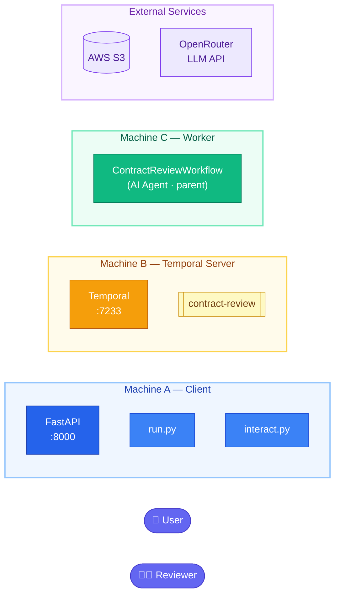
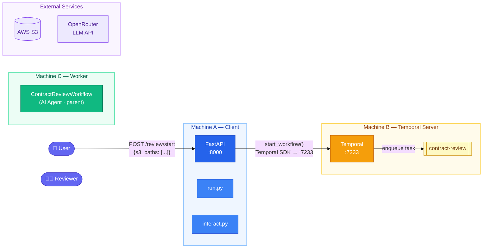
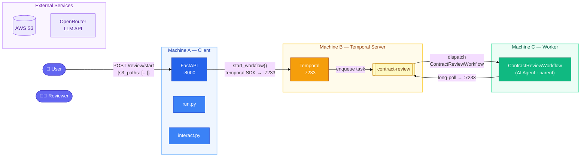
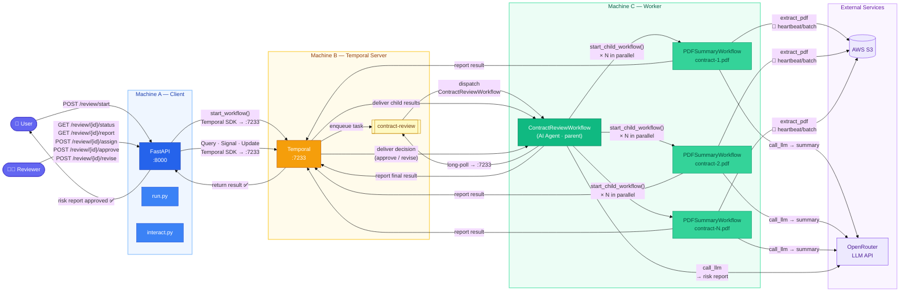

# AI Contract Review Agent — Temporal Architecture Diagrams

A step-by-step build-up of the AI agent architecture,
from isolated components to the complete data flow.

---

## Step 1 — The Components, Isolated

Five independent zones, no connections yet.
Machine A hosts the FastAPI HTTP client and CLI tools.
Machine B is the Temporal server.
Machine C runs the worker (parent + child workflows).
External services (S3, OpenRouter) sit outside every machine.

---

## Step 2 — User Submits Contracts

The user sends a `POST /review/start` request to the FastAPI app with a list of N S3 paths.
The API calls the Temporal SDK to start `ContractReviewWorkflow`.
Temporal accepts the job and places it on the queue.
The API returns a `workflow_id` immediately — no waiting.

---

## Step 3 — Worker Picks Up the Parent Workflow

The worker process continuously long-polls Temporal.
Temporal dispatches `ContractReviewWorkflow` to the worker.
The parent workflow starts executing.

---

## Step 4 — Parent Fans Out to N Child Workflows

The parent calls `asyncio.gather(start_child_workflow × N)`.
All N child `PDFSummaryWorkflow` instances start at the same time.
Each child has its own isolated event history — the parent history stays small.

```mermaid
%%{init: {'theme': 'base'}}%%
flowchart LR

    User(["👤 User"])
    Reviewer(["👩‍⚖️ Reviewer"])

    subgraph CM["  Machine A — Client  "]
        API["FastAPI\n:8000"]
        RunPy["run.py"]
        InteractPy["interact.py"]
    end

    subgraph TM["  Machine B — Temporal Server  "]
        Temporal["Temporal\n:7233"]
        Queue[["contract-review"]]
    end

    subgraph WM["  Machine C — Worker  "]
        Parent["ContractReviewWorkflow\n(AI Agent · parent)"]
        Child1["PDFSummaryWorkflow\ncontract-1.pdf"]
        Child2["PDFSummaryWorkflow\ncontract-2.pdf"]
        Child3["PDFSummaryWorkflow\ncontract-N.pdf"]
    end

    subgraph EXT["  External Services  "]
        S3[("AWS S3")]
        OpenRouter["OpenRouter\nLLM API"]
    end

    User -- "POST /review/start\n{s3_paths: [...]}" --> API
    API -- "start_workflow()\nTemporal SDK → :7233" --> Temporal
    Temporal -- "enqueue task" --> Queue
    Parent -- "long-poll → :7233" --> Queue
    Queue -- "dispatch\nContractReviewWorkflow" --> Parent

    Parent -- "start_child_workflow()\n× N in parallel" --> Child1
    Parent -- "start_child_workflow()\n× N in parallel" --> Child2
    Parent -- "start_child_workflow()\n× N in parallel" --> Child3

    classDef user      fill:#6366f1,stroke:#4338ca,color:#fff
    classDef api       fill:#2563eb,stroke:#1e40af,color:#fff
    classDef cli       fill:#3b82f6,stroke:#1d4ed8,color:#fff
    classDef temporal  fill:#f59e0b,stroke:#b45309,color:#fff
    classDef queue     fill:#fef9c3,stroke:#ca8a04,color:#713f12
    classDef parent    fill:#10b981,stroke:#047857,color:#fff
    classDef child     fill:#34d399,stroke:#059669,color:#064e3b
    classDef external  fill:#ede9fe,stroke:#7c3aed,color:#4c1d95

    class User,Reviewer user
    class API api
    class RunPy,InteractPy cli
    class Temporal temporal
    class Queue queue
    class Parent parent
    class Child1,Child2,Child3 child
    class S3,OpenRouter external

    style CM  fill:#eff6ff,stroke:#93c5fd,stroke-width:2px,color:#1e40af
    style TM  fill:#fffbeb,stroke:#fcd34d,stroke-width:2px,color:#92400e
    style WM  fill:#ecfdf5,stroke:#6ee7b7,stroke-width:2px,color:#065f46
    style EXT fill:#faf5ff,stroke:#d8b4fe,stroke-width:2px,color:#6b21a8
```

---

## Step 5 — Children Execute Activities

Each child runs two activities in sequence:
1. `extract_pdf` — downloads from S3, processes pages in batches of 2,
   sends a **heartbeat** after every batch with page range + char count.
2. `call_llm` — sends the extracted text to OpenRouter, returns summary + key risks.

```mermaid
%%{init: {'theme': 'base'}}%%
flowchart LR

    User(["👤 User"])
    Reviewer(["👩‍⚖️ Reviewer"])

    subgraph CM["  Machine A — Client  "]
        API["FastAPI\n:8000"]
        RunPy["run.py"]
        InteractPy["interact.py"]
    end

    subgraph TM["  Machine B — Temporal Server  "]
        Temporal["Temporal\n:7233"]
        Queue[["contract-review"]]
    end

    subgraph WM["  Machine C — Worker  "]
        Parent["ContractReviewWorkflow\n(AI Agent · parent)"]
        Child1["PDFSummaryWorkflow\ncontract-1.pdf"]
        Child2["PDFSummaryWorkflow\ncontract-2.pdf"]
        Child3["PDFSummaryWorkflow\ncontract-N.pdf"]
    end

    subgraph EXT["  External Services  "]
        S3[("AWS S3")]
        OpenRouter["OpenRouter\nLLM API"]
    end

    User -- "POST /review/start\n{s3_paths: [...]}" --> API
    API -- "start_workflow()\nTemporal SDK → :7233" --> Temporal
    Temporal -- "enqueue task" --> Queue
    Parent -- "long-poll → :7233" --> Queue
    Queue -- "dispatch\nContractReviewWorkflow" --> Parent
    Parent -- "start_child_workflow()\n× N in parallel" --> Child1
    Parent -- "start_child_workflow()\n× N in parallel" --> Child2
    Parent -- "start_child_workflow()\n× N in parallel" --> Child3

    Child1 -- "extract_pdf\n💓 heartbeat/batch" --> S3
    Child2 -- "extract_pdf\n💓 heartbeat/batch" --> S3
    Child3 -- "extract_pdf\n💓 heartbeat/batch" --> S3
    Child1 -- "call_llm\n→ summary + risks" --> OpenRouter
    Child2 -- "call_llm\n→ summary + risks" --> OpenRouter
    Child3 -- "call_llm\n→ summary + risks" --> OpenRouter

    classDef user      fill:#6366f1,stroke:#4338ca,color:#fff
    classDef api       fill:#2563eb,stroke:#1e40af,color:#fff
    classDef cli       fill:#3b82f6,stroke:#1d4ed8,color:#fff
    classDef temporal  fill:#f59e0b,stroke:#b45309,color:#fff
    classDef queue     fill:#fef9c3,stroke:#ca8a04,color:#713f12
    classDef parent    fill:#10b981,stroke:#047857,color:#fff
    classDef child     fill:#34d399,stroke:#059669,color:#064e3b
    classDef external  fill:#ede9fe,stroke:#7c3aed,color:#4c1d95

    class User,Reviewer user
    class API api
    class RunPy,InteractPy cli
    class Temporal temporal
    class Queue queue
    class Parent parent
    class Child1,Child2,Child3 child
    class S3,OpenRouter external

    style CM  fill:#eff6ff,stroke:#93c5fd,stroke-width:2px,color:#1e40af
    style TM  fill:#fffbeb,stroke:#fcd34d,stroke-width:2px,color:#92400e
    style WM  fill:#ecfdf5,stroke:#6ee7b7,stroke-width:2px,color:#065f46
    style EXT fill:#faf5ff,stroke:#d8b4fe,stroke-width:2px,color:#6b21a8
```

---

## Step 6 — Complete: Synthesis, Human Review, and Result

Children report summaries back to the parent via Temporal.
The parent (AI agent) calls OpenRouter to synthesize a consolidated risk report,
then **pauses** — consuming zero resources — waiting for a human decision.

The reviewer uses the FastAPI client:
- `GET /review/{id}/status` — **Query**: read the report preview
- `POST /review/{id}/assign` — **Signal**: record who is reviewing
- `POST /review/{id}/revise` — **Update**: request revision with feedback
- `POST /review/{id}/approve` — **Update**: approve → workflow completes

