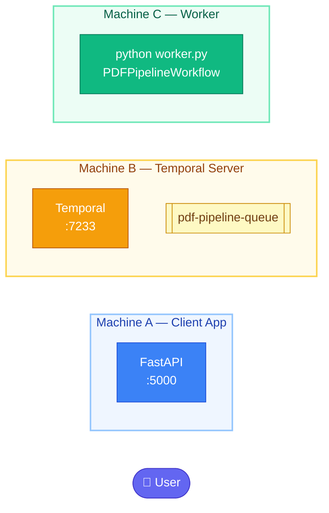
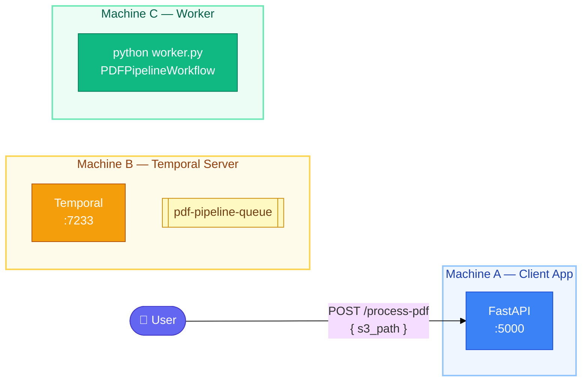
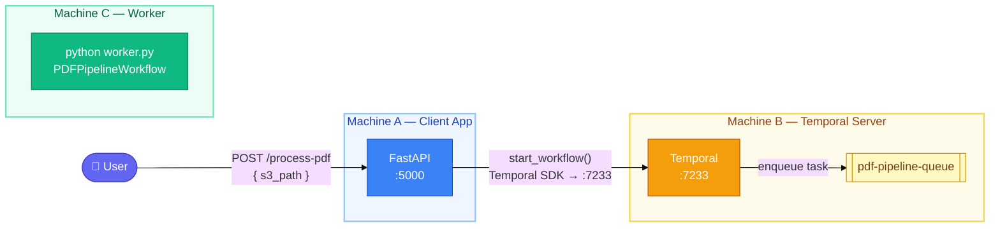

# PDF Extraction — Temporal Architecture Diagrams

A step-by-step build-up of the full system architecture,
from isolated components to the complete data flow.

---

## Step 1 — The Three Machines, Isolated

Each component runs independently on its own machine.
No connections yet.

---

## Step 2 — User Reaches the Client App

The user sends an HTTP request to the FastAPI app with the S3 path of the PDF to process.

---

## Step 3 — Client App Submits the Job to Temporal

The FastAPI app uses the Temporal SDK to start a workflow.
Temporal accepts the job and places it on the queue.
The client app does **no processing itself**.

---

## Step 4 — Worker Polls and Executes the Task

The worker process continuously long-polls Temporal for new tasks.
When a task arrives on `pdf-pipeline-queue`, Temporal dispatches it to the worker.
The worker runs the three activities: **download → extract → upload**.

```mermaid
%%{init: {'theme': 'base'}}%%
flowchart LR

    User(["👤 User"])

    subgraph CM["  Machine A — Client App  "]
        FastAPI["FastAPI\n:5000"]
    end

    subgraph TM["  Machine B — Temporal Server  "]
        Temporal["Temporal\n:7233"]
        Queue[["pdf-pipeline-queue"]]
    end

    subgraph WM["  Machine C — Worker  "]
        Worker["python worker.py\nPDFPipelineWorkflow"]
    end

    User -- "POST /process-pdf\n{ s3_path }" --> FastAPI
    FastAPI -- "start_workflow()\nTemporal SDK → :7233" --> Temporal
    Temporal -- "enqueue task" --> Queue
    Worker -- "long-poll → :7233" --> Queue
    Queue -- "dispatch task" --> Worker

    classDef user     fill:#6366f1,stroke:#4338ca,color:#fff
    classDef client   fill:#3b82f6,stroke:#1d4ed8,color:#fff
    classDef temporal fill:#f59e0b,stroke:#b45309,color:#fff
    classDef queue    fill:#fef9c3,stroke:#ca8a04,color:#713f12
    classDef worker   fill:#10b981,stroke:#047857,color:#fff

    class User user
    class FastAPI client
    class Temporal temporal
    class Queue queue
    class Worker worker

    style CM fill:#eff6ff,stroke:#93c5fd,stroke-width:2px,color:#1e40af
    style TM fill:#fffbeb,stroke:#fcd34d,stroke-width:2px,color:#92400e
    style WM fill:#ecfdf5,stroke:#6ee7b7,stroke-width:2px,color:#065f46
```

---

## Step 5 — Complete: Results Flow Back to the User

The worker reports the result back to Temporal.
Temporal delivers it to the waiting FastAPI client.
The user receives the S3 path of the generated Markdown file.

```mermaid
%%{init: {'theme': 'base'}}%%
flowchart LR

    User(["👤 User"])

    subgraph CM["  Machine A — Client App  "]
        FastAPI["FastAPI\n:5000"]
    end

    subgraph TM["  Machine B — Temporal Server  "]
        Temporal["Temporal\n:7233"]
        Queue[["pdf-pipeline-queue"]]
    end

    subgraph WM["  Machine C — Worker  "]
        Worker["python worker.py\nPDFPipelineWorkflow"]
    end

    User -- "POST /process-pdf\n{ s3_path }" --> FastAPI
    FastAPI -- "start_workflow()\nTemporal SDK → :7233" --> Temporal
    Temporal -- "enqueue task" --> Queue
    Worker -- "long-poll → :7233" --> Queue
    Queue -- "dispatch task" --> Worker
    Worker -- "report result → :7233" --> Temporal
    Temporal -- "return result" --> FastAPI
    FastAPI -- "{ output_s3_path }" --> User

    classDef user     fill:#6366f1,stroke:#4338ca,color:#fff
    classDef client   fill:#3b82f6,stroke:#1d4ed8,color:#fff
    classDef temporal fill:#f59e0b,stroke:#b45309,color:#fff
    classDef queue    fill:#fef9c3,stroke:#ca8a04,color:#713f12
    classDef worker   fill:#10b981,stroke:#047857,color:#fff

    class User user
    class FastAPI client
    class Temporal temporal
    class Queue queue
    class Worker worker

    style CM fill:#eff6ff,stroke:#93c5fd,stroke-width:2px,color:#1e40af
    style TM fill:#fffbeb,stroke:#fcd34d,stroke-width:2px,color:#92400e
    style WM fill:#ecfdf5,stroke:#6ee7b7,stroke-width:2px,color:#065f46
```

